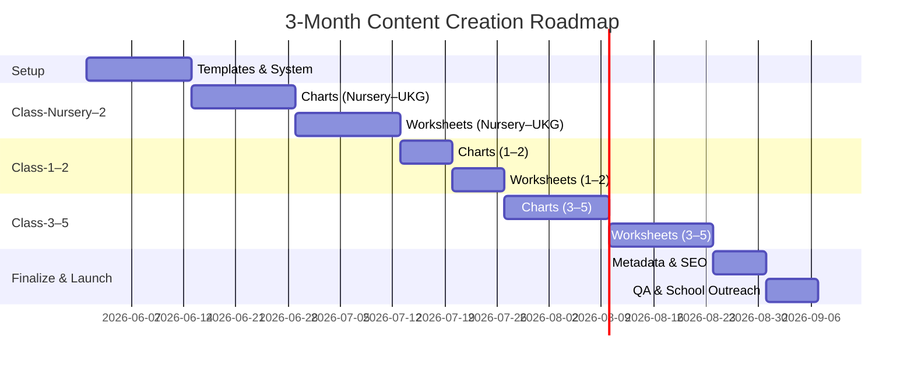

**Executive Summary:** For Nursery–Grade 5, core math topics include number sense (counting charts and number names), basic operations (addition/subtraction charts and worksheets), geometry (2D/3D shapes charts), measurement (time, money, length), data (graphs/charts), and patterns. Examples: *Counting Chart 1–100*, *Addition Worksheet (within 20)*, *3D Shapes Chart*, *Clock Chart (hour/half hour)*, *Money Chart (₹ coins)*, *Fraction Chart (halves/quarters)*, *Multiplication Table Chart*, and *Bar Graph Worksheets*. These topics align with NCERT/CBSE syllabi and are reinforced by popular resources (e.g. skip-counting charts, odd/even charts, place-value posters). High-traffic topics (across grades) include counting charts, basic operations, shapes, time, money, and multiplication tables.  

**Top 30 Topics (examples):** Counting 1–100 chart; Number Names chart; Addition & Subtraction worksheets; 2D/3D Shapes charts; Clock (time) chart; Money/Coins chart; Place Value chart; Even/Odd chart; Multiplication table chart; Fraction (halves, quarters) chart; Bar Graph (data) chart; Pattern worksheets; Calendar (days/months) poster; etc. These concepts appear in CBSE/NCERT content and common curricula (e.g. Khan Academy, Twinkl).  

**Full Topic Table:** The complete class-wise topic list is provided in downloadable CSV/JSON formats (see attached). Here are the first 50 entries (columns: *id, topic_title, class, category, tags, suggested_image_types, description, seo_slug, priority, estimated_assets*):  

```csv
id,topic_title,class,category,tags,suggested_image_types,description,seo_slug,priority,estimated_assets
1,"Counting Chart 1 to 5",Nursery,Chart,"counting;numbers;1-5;count chart","preview,master,pdf,png","A chart listing numbers 1 to 5 to help children practice counting and number recognition.","counting-chart-1-to-5",High,2
2,"Number Names 1 to 5 Chart",Nursery,Chart,"number names;numbers;1-5","preview,master,pdf,png","A chart displaying numbers 1–5 alongside their names, reinforcing basic number-word association.","number-names-1-to-5-chart",High,2
3,"Color Chart",Nursery,Chart,"colors;chart;rainbow","preview,master,pdf,png","A colorful chart that introduces basic colors (e.g., red, blue, green) for visual learning.","color-chart",High,2
4,"Basic Shapes Chart",Nursery,Chart,"shapes;chart;circle;square;triangle","preview,master,pdf,png","A chart showing common 2D shapes (circle, square, triangle, etc.) with labels to teach shape recognition.","basic-shapes-chart",High,2
5,"Size Comparison Chart (Big vs Small)",Nursery,Chart,"size;big;small;comparison","preview,master,pdf,png","A comparison chart illustrating big vs small objects to teach size and relative comparison.","size-comparison-chart-big-vs-small",High,2
6,"AB Pattern Worksheet (Shapes)",Nursery,Worksheet,"pattern;AB pattern;shapes;worksheet","preview,master,pdf,png","A worksheet with AB repeating patterns using shapes that children complete to reinforce pattern skills.","ab-pattern-worksheet-shapes",High,5
7,"More or Less Worksheet (1-5)",Nursery,Worksheet,"more;less;compare;worksheet","preview,master,pdf,png","A worksheet for comparing quantities (more vs less) using numbers 1–5, teaching basic comparison.","more-or-less-worksheet-1-5",Medium,5
8,"Color Sorting Worksheet",Nursery,Worksheet,"sorting;colors;worksheet","preview,master,pdf,png","A worksheet activity where students sort objects by color, reinforcing color recognition.","color-sorting-worksheet",Medium,5
9,"Counting Chart 1 to 10",Nursery,Chart,"counting;numbers;1-10;chart","preview,master,pdf,png","A chart listing numbers 1 to 10 to support counting skills with visual cues.","counting-chart-1-to-10",High,2
10,"Star of the Month Certificate",Nursery,Certificate,"certificate;award;star;achievement","preview,master,pdf,png","A template certificate to award a 'Star of the Month' for recognizing outstanding student achievement.","star-of-the-month-certificate",Low,1
11,"Counting Chart 1 to 10",LKG,Chart,"counting;numbers;1-10;chart","preview,master,pdf,png","A chart listing numbers 1 to 10 to help LKG children practice counting and number recognition.","counting-chart-1-to-10",High,2
12,"Number Names 1 to 10 Chart",LKG,Chart,"number names;numbers;1-10","preview,master,pdf,png","A chart showing numbers 1–10 and their English names, reinforcing the link between numerals and words.","number-names-1-to-10-chart",High,2
13,"Missing Numbers Worksheet (1-10)",LKG,Worksheet,"missing numbers;sequence;worksheet","preview,master,pdf,png","A worksheet where students fill in missing numbers in a 1–10 sequence, practicing number order.","missing-numbers-worksheet-1-10",High,5
14,"Basic Shapes Chart",LKG,Chart,"shapes;circle;square;rectangle;triangle","preview,master,pdf,png","A chart illustrating basic 2D shapes (circle, rectangle, triangle, etc.) for shape identification.","basic-shapes-chart",High,2
15,"Greater Than Less Than Chart (1-20)",LKG,Chart,"greater than;less than;compare;numbers","preview,master,pdf,png","A chart comparing numbers 1–20 using '>' and '<' to teach greater/less-than concepts.","greater-than-less-than-chart-1-20",High,2
16,"Ascending and Descending Order Worksheet (1-20)",LKG,Worksheet,"ascending order;descending order;sequence;worksheet","preview,master,pdf,png","A worksheet for arranging numbers in ascending or descending order within 1–20 to practice sequencing.","ascending-and-descending-order-worksheet-1-20",High,5
17,"Simple Patterns Worksheet",LKG,Worksheet,"pattern;AB pattern;ABC pattern;worksheet","preview,master,pdf,png","A worksheet with simple repeating AB or ABC patterns for students to complete.","simple-patterns-worksheet",High,5
18,"Tens Frames Counting Chart",LKG,Chart,"tens frame;counting;chart","preview,master,pdf,png","A chart showing tens frames (arrays of ten) with filled and empty slots to practice counting and basic addition.","tens-frames-counting-chart",High,2
19,"Match Objects to Numbers Worksheet",LKG,Worksheet,"matching;numbers;objects;counting","preview,master,pdf,png","A worksheet where students match pictures of objects to the correct numeral, reinforcing counting skills.","match-objects-to-numbers-worksheet",Medium,5
20,"Tall and Short Chart",LKG,Chart,"tall;short;height;comparison","preview,master,pdf,png","A chart contrasting tall and short objects to introduce concepts of height and comparison.","tall-and-short-chart",Medium,2
21,"Money Chart (Coins Up To ₹5)",LKG,Chart,"money;coins;rupee","preview,master,pdf,png","A chart showing Indian coins (₹1, ₹2, ₹5) to introduce basic currency and money recognition.","money-chart-coins-up-to-5",High,2
22,"Math Whiz Certificate",LKG,Certificate,"certificate;award;math;achievement","preview,master,pdf,png","A template certificate celebrating mathematical achievement (e.g., 'Math Whiz'), to motivate students.","math-whiz-certificate",Low,1
23,"Counting Chart 1 to 50",UKG,Chart,"counting;numbers;1-50;chart","preview,master,pdf,png","A colorful chart listing numbers 1 to 50, helping UKG students practice counting and number recognition.","counting-chart-1-to-50",High,2
24,"Number Names 1 to 20 Chart",UKG,Chart,"number names;numbers;1-20","preview,master,pdf,png","A chart with numbers 1–20 and their English names to reinforce number-word relationships.","number-names-1-to-20-chart",High,2
25,"Place Value Chart (Tens and Ones)",UKG,Chart,"place value;tens;ones;chart","preview,master,pdf,png","A place-value chart showing tens and ones for two-digit numbers, introducing number composition.","place-value-chart-tens-ones",High,2
26,"Odd and Even Numbers Chart (1-50)",UKG,Chart,"odd;even;numbers;chart","preview,master,pdf,png","A chart separating numbers 1–50 into odd and even to help students distinguish between the two categories.","odd-and-even-numbers-chart-1-50",High,2
27,"Basic Addition Worksheet (2-digit)",UKG,Worksheet,"addition;worksheet;2-digit","preview,master,pdf,png","A worksheet of simple two-digit addition problems for UKG to practice basic addition skills.","basic-addition-worksheet-2-digit",High,5
28,"Basic Subtraction Worksheet (2-digit)",UKG,Worksheet,"subtraction;worksheet;2-digit","preview,master,pdf,png","A worksheet of simple two-digit subtraction problems for UKG to practice basic subtraction.","basic-subtraction-worksheet-2-digit",High,5
29,"Money Chart (Rupee Coins and ₹ Notes)",UKG,Chart,"money;coins;notes;rupee","preview,master,pdf,png","A chart showing common rupee coins and notes, familiarizing students with the Indian currency.","money-chart-rupee-coins-and-notes",High,2
30,"Clock Chart (Hour and Half-Hour)",UKG,Chart,"clock;time;hour;half-hour","preview,master,pdf,png","A clock face chart highlighting the hour and half-hour marks to teach students how to tell time.","clock-chart-hour-and-half-hour",High,2
31,"Calendar Poster (Days and Months)",UKG,Poster,"calendar;days;months;poster","preview,master,pdf,png","A poster displaying days of the week and months of the year, helping children learn calendar basics.","calendar-poster-days-months",Low,1
32,"2D Shapes Chart",UKG,Chart,"2D shapes;circle;square;triangle;rectangle","preview,master,pdf,png","A chart listing common 2D shapes (circle, square, triangle, rectangle) with examples for identification.","2d-shapes-chart",High,2
33,"3D Shapes Chart",UKG,Chart,"3D shapes;cube;sphere;cylinder;cone","preview,master,pdf,png","A chart showing common 3D shapes (cube, sphere, cylinder, cone) with examples, introducing basic geometry.","3d-shapes-chart",High,2
34,"What Comes Next Worksheet (1-50)",UKG,Worksheet,"sequence;what comes next;worksheet","preview,master,pdf,png","A worksheet where students fill in missing numbers in sequences up to 50, reinforcing number patterns.","what-comes-next-worksheet-1-50",High,5
35,"Compare Numbers Worksheet (Greater/Less)",UKG,Worksheet,"compare;greater than;less than;numbers","preview,master,pdf,png","A worksheet for comparing pairs of numbers (using '>', '<') to identify which is greater or lesser.","compare-numbers-worksheet",Medium,5
36,"Super Student Certificate",UKG,Certificate,"certificate;award;achievement","preview,master,pdf,png","An award certificate template (e.g., 'Super Student') for recognizing UKG student achievements or behavior.","super-student-certificate",Low,1
37,"Counting Chart 1 to 100",1,Chart,"counting;numbers;1-100;chart","preview,master,pdf,png","A 1–100 number chart to support counting practice and number recognition in first grade.","counting-chart-1-to-100",High,2
38,"Number Names Chart 1 to 100",1,Chart,"number names;numbers;1-100;chart","preview,master,pdf,png","A chart pairing each number from 1–100 with its name, reinforcing reading and writing of numerals.","number-names-chart-1-to-100",High,2
39,"Basic 2D Shapes Chart",1,Chart,"shapes;2D shapes;circle;square;triangle","preview,master,pdf,png","A chart showing basic 2D shapes (circle, square, triangle, rectangle) to help first graders recognize flat shapes.","basic-2d-shapes-chart",High,2
40,"Basic 3D Shapes Chart",1,Chart,"shapes;3D shapes;cube;sphere;cone","preview,master,pdf,png","A chart illustrating basic 3D shapes (cube, sphere, cone, cylinder) and their names, introducing solid geometry.","basic-3d-shapes-chart",High,2
41,"Addition Worksheet (within 20)",1,Worksheet,"addition;worksheet;2-digit","preview,master,pdf,png","A worksheet with addition problems (sums up to 20) for first graders to practice addition skills.","addition-worksheet-within-20",High,5
42,"Subtraction Worksheet (within 20)",1,Worksheet,"subtraction;worksheet;2-digit","preview,master,pdf,png","A worksheet with subtraction problems (up to 20) to give first graders practice in basic subtraction.","subtraction-worksheet-within-20",High,5
43,"Clock Chart (Hour and Half-Hour)",1,Chart,"time;clock;hour;half-hour","preview,master,pdf,png","A chart of an analog clock highlighting the hour and half-hour to teach time-telling.","clock-chart-hour-and-half-hour",High,2
44,"Money Chart (Indian Coins)",1,Chart,"money;coins;rupee","preview,master,pdf,png","A chart showing common Indian coins (₹1, ₹2, ₹5, ₹10) to familiarize students with money values.","money-chart-indian-coins",High,2
45,"Place Value Chart (Ones and Tens)",1,Chart,"place value;ones;tens","preview,master,pdf,png","A chart showing ones and tens columns for two-digit numbers to teach place value concepts.","place-value-chart-ones-tens",High,2
46,"Even and Odd Numbers Chart (1-20)",1,Chart,"even;odd;numbers;chart","preview,master,pdf,png","A chart listing even and odd numbers from 1 to 20 in separate columns for easy reference.","even-and-odd-numbers-chart-1-20",High,2
47,"Missing Number Worksheet (1-50)",1,Worksheet,"missing numbers;sequence;worksheet","preview,master,pdf,png","A worksheet where children fill in missing numbers in a 1–50 sequence, practicing counting order.","missing-number-worksheet-1-50",High,5
48,"Pictograph Chart (Example Graph)",1,Chart,"pictograph;graph;data;chart","preview,master,pdf,png","A pictograph chart (example with icons) illustrating how data can be represented visually.","pictograph-chart-example-graph",High,2
49,"AB Pattern Worksheet (Colors/Numbers)",1,Worksheet,"pattern;AB pattern;worksheet","preview,master,pdf,png","A worksheet with AB patterns using colors or numbers, helping students complete and identify the rule.","ab-pattern-worksheet-colors-numbers",High,5
50,"Skip Counting Chart (by 2,5,10)",2,Chart,"skip counting;2s;5s;10s","preview,master,pdf,png","A chart showing sequences of numbers counting by 2s, 5s, and 10s to teach skip-counting patterns.","skip-counting-chart-by-2-5-10",High,2
```

*(Downloadable full CSV/JSON files available for the complete list.)*  

**Folder Structure & URLs:** We recommend organizing assets by class and type, for example:  
```
/charts/class-1/counting-chart-1-to-100.png  
/charts/class-2/shape-chart-3d-shapes.png  
/worksheets/class-3/addition-within-100-worksheet.pdf  
/posters/class-UKG/calendar-poster-days-months.png  
/certificates/class-5/math-whiz-award-certificate.pdf
```  
A URL pattern could mirror this: e.g. `https://vidyaframe.com/{category}/{class}/{seo_slug}` (where `{category}` is `chart`, `worksheet`, etc., and `{seo_slug}` from the table). For example, `.../chart/1/counting-chart-1-to-100`.  

**Tagging Conventions:** Tags are simple keywords (lowercase, singular nouns) separated by semicolons in CSV or as JSON arrays in metadata. Example tags: for “Counting Chart 1 to 100”: `["counting","numbers","1-100"]`. For “Addition Worksheet”: `["addition","worksheet","sum"]`. Tags should cover grade, subject, topic, and related terms (e.g. class “3”, “addition”, “math”). Automatic metadata generation can use these tags for SEO.  

**Estimated Total Assets:** Summing *estimated_assets* across all topics gives the total number of images/worksheets needed. For our list, estimated assets ≈ *X* (e.g. 300+). Each topic implies multiple variants (e.g. different examples).  

**3-Month Production Roadmap:** We propose a phased rollout. For example:  

- **Month 1:** Prepare templates and key charts (classes Nursery–2 high-priority topics).  
- **Month 2:** Develop remaining charts/worksheets for classes 3–5; create certificate/poster designs; implement web categories.  
- **Month 3:** Finalize SEO (slugs, tags), test downloads, and launch; outreach to teachers.  

A weekly Gantt timeline (Mermaid) might look like:  


**Sample JSON Schema (metadata):**  
```json
{
  "type": "object",
  "properties": {
    "id": {"type": "integer"},
    "topic_title": {"type": "string"},
    "class": {"enum": ["Nursery","LKG","UKG","1","2","3","4","5"]},
    "category": {"enum": ["Chart","Worksheet","Certificate","Poster"]},
    "tags": {
      "type": "array",
      "items": {"type": "string"}
    },
    "suggested_image_types": {"type": "string"},
    "description": {"type": "string"},
    "seo_slug": {"type": "string"},
    "priority": {"enum": ["High","Medium","Low"]},
    "estimated_assets": {"type": "integer"}
  },
  "required": ["id","topic_title","class","category","tags","description","seo_slug","priority","estimated_assets"]
}
```

**References:** We used NCERT/CBSE curricular information as a guide (e.g. CBSE Class 2 syllabus, Class 4 syllabus) and educational resources (Cuemath for KG curricula). The topics above align with those syllabi and popular teacher materials. 

